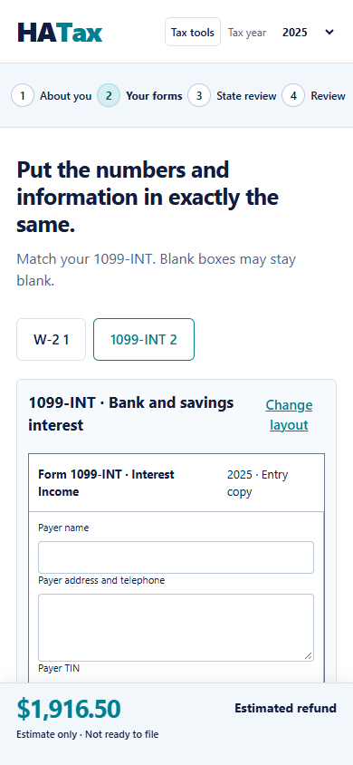

# Bank and savings interest entry

Choose **1099-INT · Bank and savings interest**, confirm the form, then choose
the standard or stacked arrangement. Copy the numbered boxes from the document.
Payer and recipient information, corrected/FATCA checkboxes, and multiple state
rows remain part of the entry. Changing layouts preserves the information.

The basic federal scenario adds boxes 1 and 3 to taxable interest, keeps box 8
tax-exempt interest separate, and adds box 4 to federal withholding. Interest
documents never enter the W-2 wages list. The sidebar shows both interest totals
separately. These mappings follow the [IRS Form 1099-INT recipient instructions](https://www.irs.gov/pub/irs-pdf/f1099int.pdf)
and [Form 1040 interest instructions](https://www.irs.gov/instructions/i1040gi).

Penalties, investment expenses, foreign tax/country, private-activity bond
interest, market discount and bond premiums need further treatment. Corrected
forms and unanswered or affirmative special-treatment questions also hold the
estimated tax, refund and balance. Aggregate taxable interest above $1,500 holds
the scenario pending Schedule B and its reporting questions. These are recorded
inputs for review; the system does not quietly assume their tax treatment.

This preview supports single filers in 2024–2026 and the existing basic ordinary
bracket scenario. It excludes credits, other adjustments, additional taxes and
state calculations. It uses ordinary brackets rather than the final IRS Tax
Table calculation. It does not authorize filing or export official IRS forms.
Connected business records still hold combined tax/refund figures pending their
tax treatment. Tax-exempt interest is retained for later return/credit handling;
it is not added to taxable income in this scenario.

Protected snapshots accept exact interest-box text and state rows through the
existing scoped encrypted saving service. Public estimate requests contain
amounts and review flags; payer/recipient identity stays out of those requests.
Public-page inputs remain in page memory and clear on refresh.

## Verification

Fresh Windows PostgreSQL suite: 306 tests ran, 302 passed, four Linux-only checks
skipped. New calculation cases cover taxable versus exempt amounts, withholding,
multiple forms, Schedule B threshold, invalid values and review holds. Snapshot
roundtrip checks preserve exact strings, blank boxes and multiple state rows.

The actual local HTTP browser journey combines a $45,000 W-2 with $600 taxable
interest, $800 exempt interest and $60 additional withholding. Its basic refund
scenario is $1,916.50, returning to $1,928.50 when the interest form is removed.
Layout changes, W-2 switching, state review, review holds and 390px mobile fit
pass without mocked API routes.

The MFA browser verifier includes an additional same-session encrypted interest
save/reload/reopen check. Its executed result and limits are recorded in
KEYCLOAK-NGINX-SESSION-EVIDENCE.json. Hosted storage, recovery-key custody and
complete filing remain governed by DAY8-COMPLETION-AUDIT.md.

Executed local MFA evidence: password and OTP through the HTTPS callback, encrypted 1099-INT save, reload and reopen passed. Exact 500.00/800.00 entries and special-rule answer were preserved; taxable interest remained $600.00. The connected business estimate remained held for review. This used local PostgreSQL and local encrypted objects, not hosted DigitalOcean or Spaces. This does not prove an interest-specific database backup restore.
