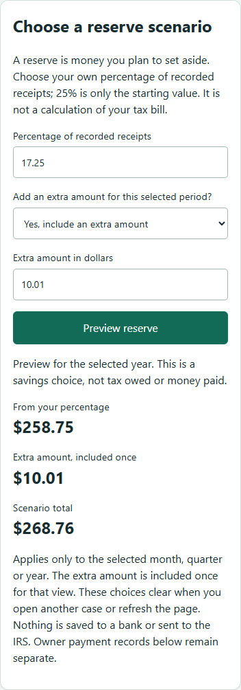

# Reserve choice

Bookin lets a permitted user preview a percentage of recorded receipts plus an
explicitly chosen extra amount for the selected month, quarter or year. The
starting 25% is a user-adjustable savings choice, not a calculated tax liability
or a recommended rate. Expenses do not reduce this particular receipts-based
scenario; book profit remains a separate figure.

The percentage accepts 0 through 100 with up to two decimal places. Choosing
Yes for an extra reserve requires a positive dollar amount with at most two
decimal places. No removes the amount. The extra applies once to the selected
period, rather than once per month within a quarter or year. The screen shows
the percentage amount, extra amount and combined total separately.

These choices live only in the open page. Refreshing or opening another case
restores 25% and No. A protected GET calculates the scenario; no ledger entry,
saved election, bank transfer or IRS payment is created. Recorded owner tax
payments retain their own totals and unverified status. Read permission and the
existing MFA session are required. Outdated responses cannot replace a newer
scenario or a different client's results.

Amounts use decimal arithmetic and integer cents, with half-up rounding of the
percentage component before adding the extra cents. This follows the exact
decimal arithmetic supported by [Python Decimal](https://docs.python.org/3/library/decimal.html).

## Verification

The Windows PostgreSQL runner completed 298 tests: 294 passed and four
Linux-only checks skipped. New checks cover validation, explicit extra choice,
rounding, each reporting period, immutable ledger history, unchanged book
profit/payment totals, and default values after a new repository instance.

The extended MFA/nginx browser verifier checks rendered reserve values,
month/quarter/year selection, unchanged ledger revision and payments, mobile
fit, removing the extra amount, and clearing fields for an unrelated case.
The actual local Keycloak/nginx/PostgreSQL/ClamD/AES-GCM fixture passed these
checks, protected tax saving/reopening and logout denial. The rendered portion
measured 9.2 seconds including browser password/OTP, excluding fixture startup
and waits. `KEYCLOAK-NGINX-SESSION-EVIDENCE.json` records the result and its limits.
The browser accepted the disposable self-signed certificate; this does not prove
hosted browser certificate trust.

This remains local fictional evidence. Hosted identity/storage, recovery-key
custody, banking/payment authority and final return calculations remain pending
in `DAY8-COMPLETION-AUDIT.md`.
